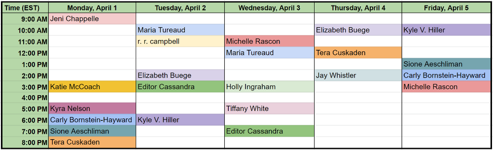

##### \#RevPit 2019 Annual Contest Begins April 6th! Learn more about the event [here](http://reviseresub.com/annual-contest).

#### 2019 Annual Contest Schedule: 

**March 11th:** Editors announced!

**April 1st-5th:** #AskEditor sessions. 
\#AskEditor Detailed Schedule  
 

**April 6th-7th:** Submission window opens.  
The submission window opens at 9am EST on April 6th and will remain open until 11:59pm EST on April 7th.

**April 6th-13th:** [#10Queries](https://katiemccoach.com/how-an-editor-sees-it-10queries?target=_blank) sessions.  
Editors will tweet out #10Queries throughout the week. Watch your chosen editors’ tweets and the #RevPit feed for schedules and details.

**April 15th:** Editor picks announced!  
Author-editor teams  will be announced beginning at noon EST.  

**April 15th-May 20th:** Author–editor teams will work  on revisions together for 5 weeks.

**May 20th:** Editing round ends.  
Editors and authors wrap up revisions and submit revised queries and first five pages by 3pm EST.

**May 23rd:** Showcase goes live!  
Agent-ready queries and pages will be shared on the #revpit website.

##### Check back here or [follow us on Twitter](https://twitter.com/ReviseResub?target=_blank) to get the latest updates.

