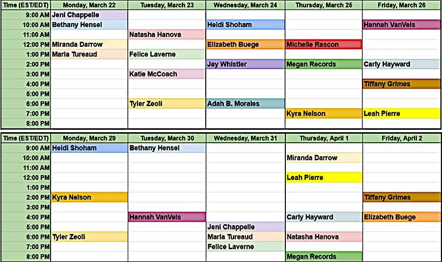

##### \#RevPit 2021 Annual Contest Begins April 10th! Learn more about the event [here](http://reviseresub.com/annual-contest).

#### 2021 Annual Contest Schedule: 

**March 5th:** Editors announced!

**March 8th-19th:** \#MeetTheEditors sessions

**March 22nd-April 2nd:** \#AskEditor sessions

 Click here for the [AskEditor Schedule](RevPit%202021%20AskEditor%20Schedule.xlsx) in Microsoft Excel.

**April 10th-11th:** Submission window opens.  
The submission window opens at 12pm EST/EDT on April 10th and will remain open until 11:59pm EST/EDT on April 11th.

**April 12th- April 23rd:** [#10Queries](https://katiemccoach.com/how-an-editor-sees-it-10queries?target=_blank) sessions.  
Editors will tweet out #10Queries throughout the two weeks. Watch your chosen editors’ tweets and the #RevPit feed for schedules and details.

**April 26th:** Editor picks announced!  
Author-editor teams  will be announced beginning at noon EST.  

**April 27th-June 21st:** Author–editor teams will work  on revisions together for 8 weeks.

**June 25th:** Showcase goes live!  
Agent-ready queries and pages will be shared on the #revpit website.

##### Check back here or [follow us on Twitter](https://twitter.com/ReviseResub?target=_blank) to get the latest updates.

