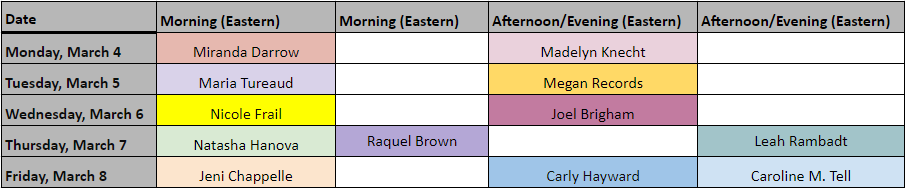
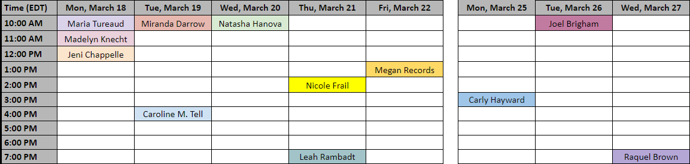

### \#RevPit 2024 Annual Contest Begins March 14th! 

Learn more about the [Annual Contest here](http://reviseresub.com/annual-contest).

#### 2024 Annual Contest Schedule: 

 * **February 23rd:** Editors announced
 * **March 4- March 8:** \#MeetTheEditor sessions
 

 
<small>[Download an Excel spreadsheet version of the #MeetTheEditor schedule here](RevPitMeetTheEditorSessions2024.xlsx)</small>

 * **March 14- March 17th:** Submission window opens
  * The submission window opens at **12pm EDT on March 14th and will remain open until 12pm EDT on March 17th**.
 * **March 17- March 25th:** First Reader Round
 * **March 18- March 27th:** \#AskEditor sessions

 
<small>[Download an Excel spreadsheet version of the #AskEditor schedule here](RevPitAskEditorSessions2024.xlsx)</small>

 * **March 28th- April 12th:** [#10Queries](https://reviseresub.com/mini-events) sessions 
  * Editors will post #10Queries throughout the two weeks. Watch your chosen editors’ posts on [the RevPit Subreddit](https://www.reddit.com/r/RevPit?target=_blank) for their posts.
 * **April 15th:** Editor picks announced! 
  * Author-editor teams announced beginning at noon EDT. 
 * **April 15th-June 10th:** Author-editor teams work on revisions for 8 weeks
 * **June 10th:** Showcase goes live! 
  * Agent-ready queries and pages shared on the #RevPit website

##### Check back here, [join our Substack newsletter](https://reviseresub.substack.com?target=_blank), or [follow our subreddit](https://www.reddit.com/r/RevPit?target=_blank) to get the latest updates.

