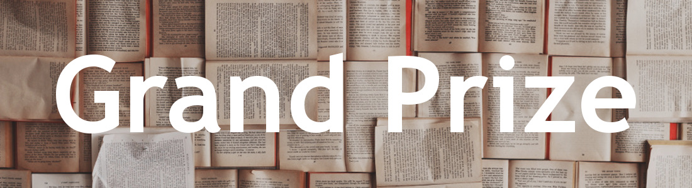

Entrants of our [Annual Contest](http://reviseresub.com/annual-contest) have the opportunity to win feedback and developmental edits on their **full** manuscript from one of our [professional editors](http://reviseresub.com/editors).

Our professional editors have donated generous amounts of time in order to help you get your manuscript as polished as possible. You win **5 weeks** of our editors’ developmental editing expertise.

Developmental editing includes (but is not limited to) story-arc, character development, structure, flow, and voice. Winners will also have access to discuss their manuscripts, ask questions about how to approach revisions, and receive advice from their editors. This type of editing can be worth upwards of _a thousand dollars_, and grand prize winners will receive it for free.

Should you win, the editor that picks you will help you with what your manuscript needs most. Every manuscript will have different needs to get it agent-ready by the showcase stage. 

## Runners-up Prizes

Each editor will **also** pick a runner-up. Each runner-up will receive a query critique and a copyedit of their 1st ten pages.

#### Query Critique: 

Kyra will critique the runner-up's query letters free of charge with one read through on revisions. She will help authors determine which information is most crucial to depicting the conflict of the story. She will also make sure that the query is organized, makes sense, and flows smoothly. The query letter is your first chance to make an impression, and query critiques will help make the story as appealing as possible. Polished queries will leave editors and agents with a gotta-read-it-now feeling and get them excited about your pages.

##### Offered by Kyra Nelson

{.float-left}

##### **Kyra Nelson**

Kyra Nelson is a YA author and freelance editor. She earned her BA in English language and Editing from Brigham Young University before completing her MA there in linguistics. She is now pursuing a degree in applied linguistics from Northern Arizona University. Before becoming a freelance editor, Kyra spent several years interning at a literary agency and working in house for various publications. She has also taught university courses in composition, grammar, and editing. 

Kyra is a recurring character on the YA WordNerds vlog. She likes keeping busy whether she's reading, writing, baking, hiking, playing violin, or just goofing off with friends. Kyra loves adventure, even if it's a small adventure like roasting Starbursts over the open flame of her stove top. [Twitter](https://twitter.com/@kyramnelson?target=_blank), [Website](https://kyramnelson.com?target=_blank)

**_What was your favorite childhood book and what did you love about it?_**

My favorite children's book was Dr. Seuss's Fox in Socks because I was a mean child who thought it was really funny when whoever was reading to me stumbled over the tongue twisters.

#### Copyedit of 1st Ten Pages:

One of our two professional copyeditors, Laura or Grace, will review the first ten pages of each runner-up’s manuscript free of charge. They will examine your writing at a cellular level to ensure that readers aren’t distracted by any embarrassing typos, grammatical errors, or stylistic inconsistencies. Since the opening pages of your story are your first and best chance to get noticed as an author, it’s absolutely crucial that those pages be as polished as possible. Feedback from an industry expert will help you transform your submission from a good first try into a publishable piece. 

##### Offered by Laura Dennison and Grace Laidlaw

{.float-left}

##### **Laura Dennison**

Laura’s goal as a copyeditor is to help you produce a polished manuscript free from pesky errors in grammar, usage, and style. She’ll help you smooth out the typos and transpositions that can hide in plain sight and slip past the eyes of even the most skilled authors.
 
She has three years’ experience working in content and copyediting roles. She graduated Magna Cum Laude from the University of New Hampshire with a BA in English and later completed her MFA in Creative Nonfiction Writing from the Mountainview MFA Low-Residency program. She served as the copyeditor for the grand prize winner of ShoreIndie 2017. [Twitter](https://twitter.com/LEDennison?target=_blank), [Website](http://booklighteditorial.com/team#laura?target=_blank)

**_What was your favorite childhood book and what did you love about it?_**

I loved Andrew Clements’s middle-grade novels The School Story and The Landry News, because they featured preteen girls who loved writing, just like I did. The protagonist in The School Story publishes a novel, and the protagonist of The Landry News starts her own newspaper. I thought that was so cool!

{.float-left}

##### **Grace Laidlaw**

Grace has worked as a professional copyeditor and proofreader for seven years. She will fix grammatical errors and clean up continuity issues so that your book becomes an absorbing, believable world and readers can lose themselves in it completely.

Grace got her start as a Managing Editorial Assistant at HarperCollins Publishers, where she reviewed manuscripts for New York Times bestselling authors such as James Rollins, Mary Jane Clark, and Tessa Dare. She has also held editorial roles at several smaller academic and nonfiction presses. Before joining the publishing industry, Grace graduated Magna Cum Laude from Columbia University with bachelor’s degrees in Creative Writing and Psychology. [Twitter](http://twitter.com/gracecopyedits?target=_blank), [Website](http://booklighteditorial.com/team#grace?target=_blank)

**_What was your favorite childhood book and what did you love about it?_**

My favorite book for years and years was Joan Aiken’s The Wolves of Willoughby Chase. I loved it because Aiken’s writing never failed to surprise; every chapter revealed a secret passageway, a shocking backstory, or an unexpected (and usually sinister) plot twist.

##### Check back here or [follow us on Twitter](https://twitter.com/ReviseResub?target=_blank) to find out more!

