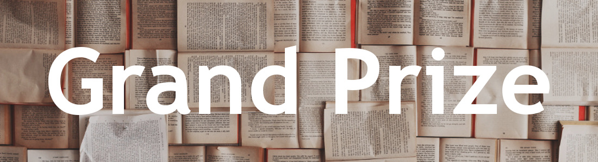

Entrants of our [Annual Contest](http://reviseresub.com/annual-contest) have the opportunity to win feedback and developmental edits on their **full** manuscript from one of our [professional editors](http://reviseresub.com/editors).

Our professional editors have donated generous amounts of time in order to help you get your manuscript as polished as possible. You win **8 weeks** of our editors’ developmental editing expertise.

For the Annual Contest, we define a developmental edit as an editorial letter (or equivalent) and consultation (via whatever means of communication editor and author agree upon). The editor will also help the author prepare a query letter edit and first five pages for the winner showcase.

Any additional edits will be up to the author's and editor's discretion and follow a mutually agreed upon timeline.

Developmental editing includes (but is not limited to) story-arc, character development, structure, flow, and voice. Winners will also have access to discuss their manuscripts, ask questions about how to approach revisions, and receive advice from their editors. This type of editing can be worth upwards of _a thousand dollars_, and grand prize winners will receive it for free.

Should you win, the editor that picks you will help you with what your manuscript needs most. Every manuscript will have different needs to get it agent-ready by the showcase stage. 

## Runners-up Prizes

#### Submission Materials Critique Package:

Runner-ups will receive a query, synopsis, and first five page critique package. This package will focus on improving the stakes and hook of your submission materials. (Please submit all materials as word documents)

##### With Megan Manzano

Having been in publishing for nine years, Megan has worked as an editor and marketing manager for Trade books and a Literary Agent at D4EO and Steven Literary. She has previously edited for the RevPit 2020 contest. When she’s not editing, she’s either snuggling her dog, or crying over a piece of media.

Website: [Megan Mazano Edits](https://meganmanzano12.wixsite.com/meg-edits/services?target=_blank)

#### One-on-one Coaching Session

A one hour one-on-one coaching session about your writing career. You know how to write, Jessica just helps with the stuff that gets in the way of doing it, like mindset, time management, owning your worth, and accepting how much creative power you really hold. 

##### With Jessica Conoley

Jessica Conoley is a writer, coach, & speaker. She founded The Creative’s Apprentice to help writers learn how to build their businesses in a mentally healthy, sustainable manner. She teaches how our personal body of creative work is the key that unlocks individual intuitive guidance, allowing us to step into our full creative power and highest potential.

Website: [The Creative's Apprentice](https://thecreativesapprentice.com?target=_blank)

##### Check back here, [get email updates](https://reviseresub.substack.com?target=_blank), or [follow us on Twitter](https://twitter.com/ReviseResub?target=_blank) to find out more!

