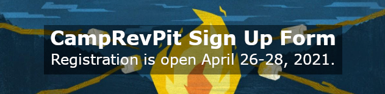

## Welcome to \#CampRevPit!

Have you ever gone on a camp retreat and felt that spark of rejuvenation? Whether you attended as a kid or an adult, there’s something magical about turning off your life for a few precious moments and rediscovering your passion.

Under the #RevPit flag, #CampRevPit is a Twitter-based writers’ “camp” led by #RevPit winner and runner-up alumni. This event is open to the whole writing community, not only people who submitted to the annual contest. Our goal is to offer an opportunity for every writer to get the inspiration and support they need, regardless of where they are in their journey.

[Follow CampRevPit on Twitter](http://twitter.com/camprevpit?target=_blank) for updates!

### Camp Activities

Each activity is separate from the others, so you’re welcome to join any&mdash;or all!

#### PROMPTS AND GAMES

* **What:** Follow the #CampRevPit hashtag to play along with Twitter games and writing prompts throughout each week! 
* **Who:** Authors who want to share their awesome ideas with the whole community
* **How to join:** No need to sign up&mdash;just follow the hashtag and join in the fun. Don’t forget to add #CampRevPit to your tweets so others can find them!
* **When:** Prompts and games run April 27, 2021-May 14, 2021.

#### CABINS

* **What:** The #CampRevPit cabins are voluntary group DM chats on Twitter. You don’t have to join a cabin to participate in the games or feedback. Campers who join cabins will be matched up with a small group of other writers and a Cabin Counselor. There will be writing sprints (or crawls!) and other prompts to help you make friends.
* **Who:** Authors who want a more personal community experience. Talk about writing, share inspiration and questions, and connect personally with other writers.
* **How to join:** When registration opens on April 26, 2021, sign up on the form at the bottom of this page. After that, your counselor will add you to your cabin via Twitter DM, so make sure your DMs are open!
* **When:** Registration is open April 26-28, 2021. Cabins run May 3-14, 2021.

#### FEEDBACK

* **What:** This is separate from the cabins. You will be matched with another writer in the same age category and genre, swap materials (however you’d like, e.g., email, Google Drive, etc.), and give each other feedback. Choose from three types of feedback (and select any/all):
  * **Query critique:** Polish your query materials.
  * **First page critique:** Make a great impression with that crucial first page.
  * **First page positivity pass:** Focus on what makes your work shine (Unfamiliar with positivity passes? Check out the post [A New Kind of Beta Reader by Katie Golding](https://www.katiegoldingbooks.com/single-post/2018/12/05/A-New-Kind-of-Beta-Reader?target=_blank))
* **Who:** Authors who want feedback on their writing and/or to meet new critique partners
* **How to join:** When registration opens on April 26, sign up on the form at the bottom of this page. You will then be connected with your partner via email.
* **When:** Registration is open April 26-28, 2021. Feedback swaps begin May 3, 2021.

### Camp Rules

\#CampRevPit is a RevPit-sponsored event, so all participants are subject to our Nondiscrimination/Anti-Harassment Policy and Complaint Procedure, as well as our Code of Conduct, which you can read on the RevPit [FAQ page](https://reviseresub.com/faq). Thanks for keeping Camp RevPit a safe and inclusive environment for everyone!

Authors from BIPOC, LGBTQ+, disabled, neurodiverse, and other historically marginalized communities are welcome and encouraged to participate.

### Meet Your Camp Staff 

Huge thanks to the #RevPit alumni helping to organize!
* [Maggie Derrick](https://twitter.com/maggiederrick?target=_blank) Camp Co-Director
* [L Jo King](https://twitter.com/jokingauthor?target=_blank) Camp Co-Director
* [Rachel Berros](https://twitter.com/berrosrachel?target=_blank) Critiques Head Counselor
* [Cameryn Frost](https://twitter.com/camerynf?target=_blank) Cabins Head Counselor
* [Mackenzie Reed](https://twitter.com/mackenziemreed7?target=_blank) Social Media Head Counselor 

**Cabins team:** 
* [Cheryl Wanner](https://twitter.com/WannerCheryl?target=_blank) 
* [Amber K Bryant](https://twitter.com/amberkbryant?target=_blank)
* [Josie Smith](https://twitter.com/josiesmithmedia?target=_blank)
* [John Taylor](https://twitter.com/jatauthor?target=_blank)
* [Linn Coldiron](https://twitter.com/LinnColdiron?target=_blank)
* [Brianna Lieberman](https://twitter.com/briafaithwrites?target=_blank)
* [Yuchi](https://twitter.com/yuchiverse?target=_blank) 

**Critiques team:**
* [Katie LaRae](https://twitter.com/The_Katie_LaRae?target=_blank)
* [Nathalie Lawrence](https://twitter.com/natqlawrence?target=_blank)

**Social media team:** 
* [Rebecca Wilcox](https://twitter.com/wilcox_rl?target=_blank)
* [Jenna (JM) Jinks](https://twitter.com/authorjmjinks?target=_blank)
* [Alex Gotay](https://twitter.com/magellenkay?target=_blank)

### Full #CampRevPit Schedule

* April 26-28: Sign up form is open
* April 29-May 2: Counselors coordinate critique and cabin assignments
* May 3: Camp starts
* May 14: Camp ends

