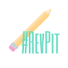

One of the things we editors love so much about the #RevPit event is that it provides so many opportunities for authors to learn new techniques, get advice from professionals, and have greater insight into what hooks a reader.
 
In preparation for our annual RevPit contest, we’ve decided to host a bonus #10Queries event for a select few writers. This event will take place this **February** (2018).
 
Are you readying your manuscript to query agents? Are you preparing for this year’s RevPit event? What better way to know if your query and first 5 pages have what it takes to stand out in the slush pile than to get an editor’s eye on it? As editors, we offer a professional perspective with insight into ways to improve your work.
 
In this event, writers will enter their names in a random drawing via Rafflecopter. If they are selected, their query and first five pages will be randomly assigned to an editor who will then tweet about the submission using #10Queries. Winners will not know which editor received their submissions until after the #10Queries tweets have been posted.
 
Tweets will consist of brief feedback based on the editors' first impressions of the winners' queries and first five pages. Not familiar with #10Queries? Learn more here: [How an Editor Sees It (#10queries)](http://katiemccoach.com/how-an-editor-sees-it-10queries?target=_blank)
 
Writers must have a complete query letter and first 5 pages of manuscript in order to enter but **will not submit these materials unless their name is drawn. **
 
Writers may enter the drawing Friday, February 16th - Tuesday, February 20th at 11:59 PM. They may enter their names multiple times via Rafflecopter (once for each editor they follow and twice **per day** for tweeting about the event), but their name can only be drawn once. We will pick 10 winners per editor.
 
_**This event is separate from the main #RevPit contest in April. For this #10queries event, winners will not receive a full edit.**_

##### Schedule:
 
**Friday, February 16th:** Contest drawing opens for writers. Writers will enter through Rafflecopter (access at the bottom of the page. It will not be active until February 16th).

To be eligible to win, writers can only enter through Rafflecopter. 
 
**Tuesday, February 20th at 11:59 PM:** Drawing closes, and winners will be notified via email. They will then be asked to send their query/five pages to the RevPit email account. **Winners must email their materials to the Revise & Resub email address no later than 11:59pm on Wednesday the 21st. In order to provide enough time for editors to read all materials, no late submissions will be accepted.**
 
**Wednesday, February 21st – Thursday, February 22nd:** Editors will review the submission packages.
 
**Friday, February 23rd – Saturday, February 24th:** The editors will share their #10queries over the course of the two days! Winners will not be named in the tweets. Editors will email writers separately to notify which #10Queries tweet was theirs and to explain the tweet.

**Participation from all contestants is encouraged. Even if your name isn’t drawn in the raffle, you can learn so much from the #10queries tweets.**

##### \#10Queries Schedule:

 
###### Note: Now that Twitter no longer limits tweets to 140 characters we may even have longer #10Queries tweets.

##### Editors participating in this event:

* [Sione Aeschliman](http://sioneaeschliman.blogspot.com?target=_blank)
* [Carly Bornstein-Hayward](http://booklighteditorial.com?target=_blank)
* [Ellen Brock](https://ellenbrockediting.com?target=_blank)
* [Elizabeth Buege](http://www.elizabethbuege.com?target=_blank)
* [r.r. campbell](https://rrcampbellwrites.com?target=_blank)
* [Jeni Chappelle](http://www.jenichappelle.com?target=_blank)
* [Stephanie Eding](https://www.stephanieediting.com?target=_blank)
* [Kyle V. Hiller](https://www.kylevedits.com?target=_blank)
* [Kaitlyn Johnson](http://www.kjohnsonfreelance.com?target=_blank)
* [Meg LaTorre](https://meglatorre.com?target=_blank)
* [Katie McCoach](http://katiemccoach.com?target=_blank)
* [Kyra M. Nelson](https://kyramnelson.com?target=_blank)
* [Kimberly Smith Ashley](http://www.kmsmithwrites.com?target=_blank)
 
This is a learning opportunity for any writer. We hope to see you participate! And remember that every writer can benefit from following the #10Queries thread on **February 23rd and 24th**.

<a class="rcptr" href="http://www.rafflecopter.com/rafl/display/128629d238/" rel="nofollow" data-raflid="128629d238" data-theme="classic" data-template="" id="rcwidget_zyohmvuh">a Rafflecopter giveaway</a>

