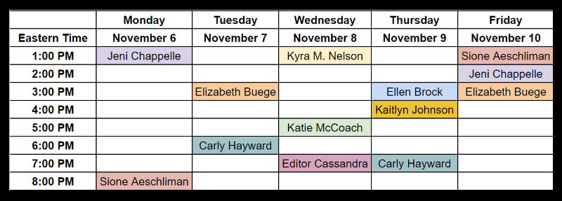

##### Join us throughout the week of November 6th to ask our editors anything!

Have questions about plot issues? Query letters? Prologues? Show don’t tell? Favorite ice cream flavors? 

**November 6th – 10th**, the RevPit editors will be holding #AskEditor sessions, one hour long per editor, to answer your writing questions. This is your chance to pick the brains of industry professionals and better your writing. 

Or, you know, we can also talk about our pets. 

#### Event Details

**What:** An informal discussion on writing tips with editors

**When:** 11/6/2017 – 11/10/2017

**Where:** On Twitter, using the **#AskEditor** and **#RevPit** hashtags

**Who:** The editors of #RevPit and YOU

**Why:** Because we love you, writers. 

#### Schedule:

###### Check back periodically for updates to the schedule

 

To stay up-to-date on RevPit news and April’s contest, be sure to follow us on Twitter: [@ReviseResub](https://twitter.com/ReviseResub?target=_blank)

**Have questions? Email them to reviseresub@gmail.com**